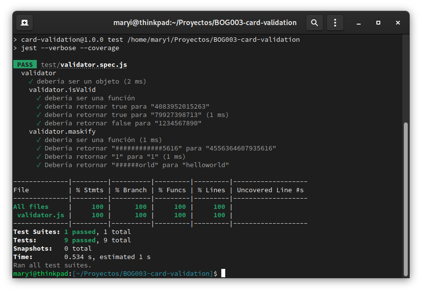

# Tarjeta de Crédito- Validador

Con este proyecto buscamos el desarrollo de nuestras habilidades en la ejecución de una Tarjeta de crédito- validador,a la par con los objetivos de aprendizaje establecidos, manejando **HTML,CSS,JS, e implementando del algoritmo de LUHN** basados en auto aprendizaje,documentación y ayudantias en duplas,estableciéndose así  un tiempo según cada proceso de aprendizaje. podrá visualizare  una pagina sencilla,agradable y entendible a la vista del usuario,la cual cumple con los objetivos trazados y los requerimientos de la validación según lo fijado en el proyecto.
# Objetivos de aprendizaje
Según lo desarrollado en el transcurso de este tiempo se cumplió con los siguientes objetivos:
**Manejo de HTML:**
Etiquetas: Input,label,div,br,
Atributos: Clase o Id.
**Manejo de Java Scrip:**
Funciones.
Objetos. 
Variables (let).
Condicionales(if- else).
Bucles (for).

**Algoritmo de Luhn:**
Se creó una función llamada isValid() que valida el número de la tarjeta, implementando el algoritmo de Luhn:
- Se define una variable sumatoria que almacenará la sumatoria en el proceso.
- Se define una variable booleana que inidica si el número actual debe ser evaluado.
- Se recorren los digitos de derecha a izquierda:
  - Si el numero debe evaluarse (requiereValidar)entonces el valor del digito va a ser el digito * 2 
  - si el valor del digito es mayor a 9 entonces digito sera igual al digito menos 9.
  - si el residuo de la sumatoria final al dividirla por 10 es 0 entonces significa que el numero es valido, 
  - Esta funcion retorna falso o verdadero segun el caso. 

```js
  isValid: function (valor) {
    let sumatoria = 0;
    let requiereValidar = false;

    for (let n = valor.length - 1; n >= 0; n--) {
      let digito = parseInt(valor[n]);

      if (requiereValidar) {
        digito = (digito * 2);
      }

      if (digito > 9) {
        digito = digito - 9;
      }

      sumatoria = sumatoria + digito;
      requiereValidar = !requiereValidar;
    }

    return sumatoria % 10 == 0;
  },
```


**Maskify**
La función recibe un parámetro "numero_oculto" que será el texto a enmascarar.
Se crea una variable "mascara" que es un arreglo que va a contener       los caracteres del texto enmascarado.
 - Se recorren los caracteres de la variable "numero_oculto" con un for.
 - Dentro del for se revisa si el indice actual "i" es menor a el tamaño del texto "numero_oculto" menos 4, si es menor entonces se       almacena un # en el arreglo "mascara",en la misma posición que el       carácter actual, si no es menor entonces se almacena en el arreglo       "mascara" el carácter original de la variable "numero_oculto".
 - Finalmente se construye un string a partir del contenido del arreglo "mascara" usando .join("") y devolvemos ese resultado con return.
 ```js
	maskify: function (numero_oculto) {
        let mascara = [];
        for (let i = 0; i < numero_oculto.length; i++) {
            if (i < numero_oculto.length - 4) {
                mascara[i] = "#";
            } else {
                mascara[i] = numero_oculto[i];
            }
        }
        return mascara.join("");
    }
```
**Manejo de CSS:**

seleccionar elementos de HTML con selectores como:

- Llamado de clases con (.).
- Llamado de id (#).
- 
Propiedades de CSS:
- Colores.
- Como generar una grilla.
- Tamaños.
- Bordes.
- estilos de Imagenes.
- Como hacer margenes

**Testing**




